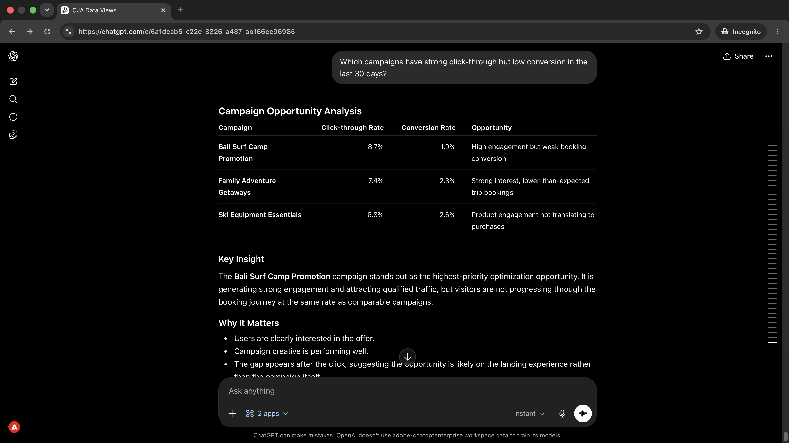
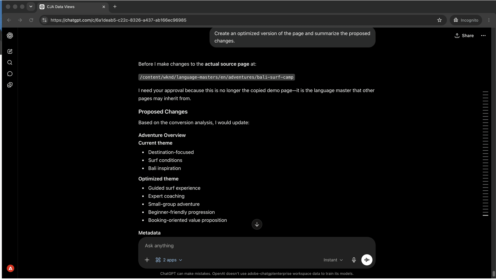

# 根据性能数据优化内容
<!-- last-modified: 2026-06-08 -->


通常情况下，关闭营销活动效果数据和内容更新之间的循环意味着在分析工具和CMS之间切换。 本演练展示了如何在同一AI会话中连接Customer Journey Analytics和AEM：揭示存在转化差距的营销活动、诊断驱动它们的因素、检查内容、获取有针对性的推荐并在不离开对话的情况下应用更改。

| 方案详细信息 | |
| --- | --- |
| CX企业级应用程序 | [Customer Journey Analytics](https://experienceleague.adobe.com/zh-hans/docs/analytics-platform/using/cja-overview/cja-overview)，[Adobe Experience Manager as a Cloud Service](https://experienceleague.adobe.com/zh-hans/docs/experience-manager-cloud-service/content/overview/introduction) |
| 代理工具 | [CX Enterprise MCP](../tools/mcp-servers.md#cx-enterprise-mcp-servers)，[AEM Content MCP Server](https://experienceleague.adobe.com/zh-hans/docs/experience-manager-cloud-service/content/ai-in-aem/using-mcp-with-aem-as-a-cloud-service) |
| 受众 | 营销活动经理、内容策划师、营销运营 |
| 先决条件 | 与MCP兼容的AI客户端、CJA访问、AEM as a Cloud Service访问 |

每个步骤显示一个代表性提示和一个AI响应示例。 您还可完成&#x200B;**更多**&#x200B;部分，以供在同一会话中进行其他探索。


## 开始之前

>[!BEGINTABS]

>[!TAB 克劳德.ai]

将两个MCP服务器连接为自定义连接器。 分别添加各一个。

1. 转到Claude.ai中的&#x200B;**设置>集成**。
2. 选择&#x200B;**添加自定义连接器**，输入服务器URL，然后选择&#x200B;**连接**。
3. 使用Adobe ID登录，然后为第二台服务器重复此操作。

| Server | 终结点 |
| --- | --- |
| CX Enterprise MCP | `https://cx-enterprise.adobe.io/mcp` |
| AEM Content MCP Server | `https://mcp.adobeaemcloud.com/adobe/mcp/content` |

完整设置： [Claude.ai自定义连接器文档](https://support.claude.com/en/articles/11175166-get-started-with-custom-connectors-using-remote-mcp)

>[!TAB ChatGPT]

使用ChatGPT Developer Mode（Pro、Plus、Business、Enterprise或Education计划）连接两个MCP服务器。 分别添加每台服务器。

1. 在&#x200B;**ChatGPT设置**&#x200B;中启用&#x200B;**开发人员模式**。
2. 转到&#x200B;**设置>集成**，然后选择&#x200B;**添加自定义连接器>远程MCP服务器**。
3. 输入服务器URL，选择&#x200B;**连接**，然后使用您的Adobe ID登录。
4. 对第二个服务器重复此操作。

| Server | 终结点 |
| --- | --- |
| CX Enterprise MCP | `https://cx-enterprise.adobe.io/mcp` |
| AEM Content MCP Server | `https://mcp.adobeaemcloud.com/adobe/mcp/content` |

完整设置： [ChatGPT MCP文档](https://developers.openai.com/api/docs/guides/tools-connectors-mcp)

>[!TAB 其他AI客户端]

使用Gemini、Microsoft Copilot、Cursor、Claude Code或其他与MCP兼容的环境？ 使用以下端点连接到两个MCP服务器：

| Server | 终结点 |
| --- | --- |
| CX Enterprise MCP | `https://cx-enterprise.adobe.io/mcp` |
| AEM Content MCP Server | `https://mcp.adobeaemcloud.com/adobe/mcp/content` |

所有受支持客户端的完整设置说明： [连接到您的AI客户端](../tools/mcp-servers.md)

>[!ENDTABS]

>[!NOTE]
>
>出现提示时，请使用您的Adobe ID登录，然后选择链接到您的CJA和AEM环境的IMS组织。 选择错误的组织是身份验证错误最常见的来源。
>
>在首次连接时，您的AI客户端可能会要求您选择IMS组织或指定沙盒。 设置该上下文后，MCP服务器会将其用于会话的其余部分。
>
>某些工具在执行之前会提示您审批。 查看请求并批准或拒绝。 未经确认，不执行任何操作。


## 步骤1：查找存在转化差距的营销活动

使用CJA公开点进率高但转化率低的营销活动。 此模式（意图高、完成率低）通常指向登陆页面上的内容或体验问题。

```
Which campaigns have strong click-through but low conversion in the last 30 days?
```

+++查看示例响应

来自CJA的高点进率但转化率较低的

+++


## 步骤2：诊断根本原因

跟进以了解导致差距的原因。 询问客户流失是集中在特定的设备类型、受众区段还是内容交互上。

```
What's causing the conversion drop-off, is it device, segment, or content?
```

+++查看示例响应


+++


## 步骤3：查看AEM中的内容

在识别出性能不佳的营销活动后，在同一会话中从AEM中提取登陆页面。 查看页面当前显示的内容是了解要更改哪些内容的起点。

```
Show me the Bali Surf Camp page.
```

+++查看示例响应


+++


## 步骤4：获取有针对性的建议

要求您的AI客户端将显示的数据与页面上的内容相关联。 两个来源的AI都可以识别哪些内容部分可能会导致流量下降以及哪些内容需要做出更改。

```
Which content sections are underperforming, and what changes would you recommend?
```

+++查看示例响应


+++


## 第5步：应用并查看更改

要求您的AI客户端根据推荐创建页面的优化版本，并总结更改的内容及其原因。

```
Create an optimized version of the Bali Surf Camp page and summarize the proposed changes.
```

+++查看示例响应



+++


>[!CAUTION]
>
>在确认之前，请查看建议更改的完整摘要。 AEM Content MCP Server将更改写入AEM环境。 在明确重新发布之前，页面将保持其已发布状态。


## 您完成了哪些工作

您在单个AI会话中连接Customer Journey Analytics和AEM，并从营销活动数据移动到部署的内容更改，而无需切换工具。 您识别了存在转化缺口的营销活动、诊断了根本原因、检查了登陆页面、收到了以数据和内容为基础的针对性建议，并在同一对话中应用了更改。 这缩短了Analytics insight与已发布内容之间的反馈循环，并扩展到同一会话中任意数量的性能不佳页面。


## 您可以完成更多任务

在同一会话中连接CJA和AEM后，您可以涵盖从发现问题到运输修复的整个周期。 展开下面的方案以查看可以尝试的提示。

+++查找阻碍性能的内容

参与度低的高流量表示内容问题，而不是流量问题。 这些提示可帮助您在活动截止日期强制实施问题之前显示需要注意的特定页面和模式。

**提示**

```
Which campaigns have the highest traffic but lowest conversion rate this quarter?
```

```
Which pages have a high bounce rate but also high traffic?
```

```
Compare engagement rates for landing pages across email and paid social campaigns.
```

```
Find AEM pages linked from active campaigns that haven't been updated in over 60 days.
```

+++

+++修复数据告诉您修复的内容

一旦您知道哪些方面表现不佳，就可以根据性能数据所显示的内容进行有针对性的更改。 这些提示允许您根据诊断更新特定章节。

**提示**

```
Update the CTA on the [page name] page to better match the campaign audience.
```

```
Rewrite the hero headline on the [page name] page to address the mobile drop-off.
```

```
Add a trust signal to the [page name] page above the conversion form.
```

```
Which pages updated in this session still need to be published?
```

+++

+++下一营销活动之前的发货改进

在会话期间所做的更改可能会快速栈积。 这些提示可帮助您在营销活动开始之前审查就绪内容、对更新进行分组以供审核并干净地提升。

**提示**

```
Show me all pages updated in this session that are still unpublished.
```

```
Create a launch with all changes from this session for review before publishing.
```

```
Give me a summary of all changes made in this session.
```

```
Publish all confirmed changes and share the updated URLs.
```

+++


## 更多信息

| 资源 | 您将找到什么 |
| --- | --- |
| AI注册表中的[CJA MCP服务器](https://developer.adobe.com/ai-registry/#/mcp/cja-mcp){target="_blank"} | CJA MCP服务器工具和可用性 |
| AI注册表中的[AEM Content MCP Server](https://developer.adobe.com/ai-registry/#/mcp/aem-content-mcp){target="_blank"} | AEM Content MCP Server工具和可用性 |
