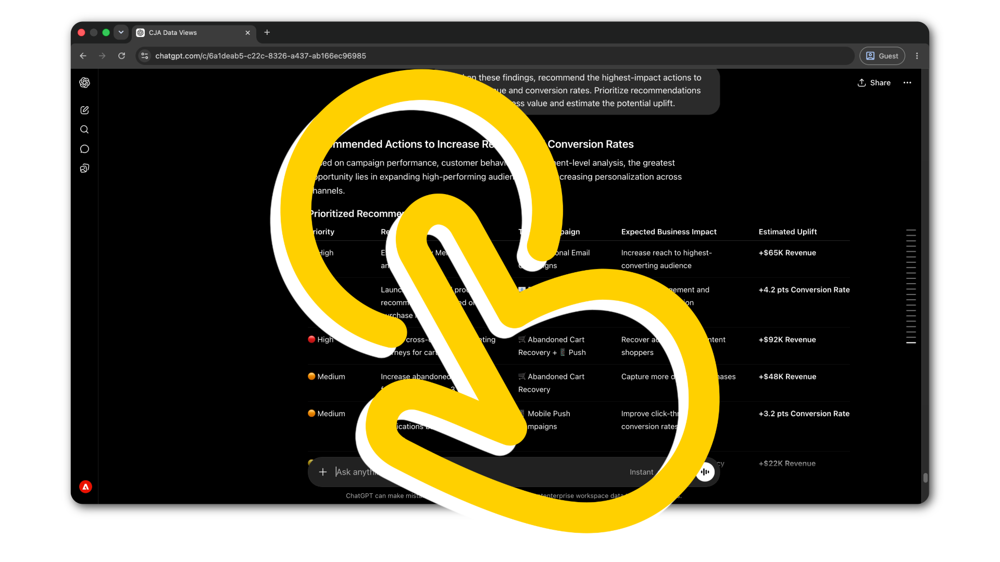

# 正在运行的代理工具

<!-- last-modified: 2026-06-08 -->

实际Adobe CX Enterprise工作流的分步演练。 每次演练从设置结束的地方开始，其中连接了一些工具，并有一个真正的工作流程来完成。

<!--
CARDS

* analyze-campaign-performance.md
  {title = Analyze campaign performance}
  {description = Surface Customer Journey Analytics comparisons and conversion trends through plain-language questions. Uses CX Enterprise MCP.}
  {cta = Start walkthrough}

* query-audiences.md
  {title = Query audiences}
  {description = Check Real-Time CDP audience activation status and destination health without navigating the platform UI. Uses CX Enterprise MCP.}
  {cta = Start walkthrough}

* manage-ajo-journeys.md
  {title = Review AJO journeys}
  {description = Get full visibility into active AJO journeys and campaign configuration without opening AJO. Uses CX Enterprise MCP.}
  {cta = Start walkthrough}

* manage-aem-content.md
  {title = Manage AEM content with AI}
  {description = Discover, update, and publish pages and content fragments using natural language. Uses the AEM Content MCP Server.}
  {cta = Start walkthrough}

* optimize-content-with-performance-data.md
  {title = Optimize content based on performance data}
  {description = Move from analytics insight to published update in one session, without switching tools. Uses CX Enterprise MCP and AEM Content MCP Server.}
  {cta = Start walkthrough}

* aem-cloud-manager-mcp.md
  {title = Manage AEM environments with Cloud Manager}
  {description = Check environment health, review pipeline runs, and manage deployments from your AI client. Uses the AEM Cloud Manager MCP Server.}
  {cta = Start walkthrough}
  {image = ../assets/use-cases/aem-cloud-manager-mcp/aem-cloud-manager-mcp-step4-01-ai.png}
-->
<!-- START CARDS HTML - DO NOT MODIFY BY HAND -->

    

        

            

                <figure class="image x-is-16by9">
                    
                </figure>
            

            

                

                    

                        <a href="analyze-campaign-performance.md" target="_blank" rel="referrer" title="分析营销活动效果">分析营销活动效果</a>
                    

                    
通过简单的语言问题显示Customer Journey Analytics比较和转化趋势。 使用CX Enterprise MCP。

                

                <a href="analyze-campaign-performance.md" target="_blank" rel="referrer" class="spectrum-Button spectrum-Button--outline spectrum-Button--primary spectrum-Button--sizeM" style="align-self: flex-start; margin-top: 1rem;">
                    开始演练
                </a>
            

        

    

    

        

            

                <figure class="image x-is-16by9">
                    
                </figure>
            

            

                

                    

                        <a href="query-audiences.md" target="_blank" rel="referrer" title="查询受众">查询受众</a>
                    

                    
无需导航平台UI，即可检查Real-Time CDP Audience Activation状态和目标运行状况。 使用CX Enterprise MCP。

                

                <a href="query-audiences.md" target="_blank" rel="referrer" class="spectrum-Button spectrum-Button--outline spectrum-Button--primary spectrum-Button--sizeM" style="align-self: flex-start; margin-top: 1rem;">
                    开始演练
                </a>
            

        

    

    

        

            

                <figure class="image x-is-16by9">
                    
                </figure>
            

            

                

                    

                        <a href="manage-ajo-journeys.md" target="_blank" rel="referrer" title="查看AJO历程">查看AJO历程</a>
                    

                    
无需打开AJO，即可全面了解活动的AJO历程和营销活动配置。 使用CX Enterprise MCP。

                

                <a href="manage-ajo-journeys.md" target="_blank" rel="referrer" class="spectrum-Button spectrum-Button--outline spectrum-Button--primary spectrum-Button--sizeM" style="align-self: flex-start; margin-top: 1rem;">
                    开始演练
                </a>
            

        

    

    

        

            

                <figure class="image x-is-16by9">
                    
                </figure>
            

            

                

                    

                        <a href="manage-aem-content.md" target="_blank" rel="referrer" title="使用AI管理AEM内容">使用AI管理AEM内容</a>
                    

                    
使用自然语言发现、更新和发布页面和内容片段。 使用AEM Content MCP Server。

                

                <a href="manage-aem-content.md" target="_blank" rel="referrer" class="spectrum-Button spectrum-Button--outline spectrum-Button--primary spectrum-Button--sizeM" style="align-self: flex-start; margin-top: 1rem;">
                    开始演练
                </a>
            

        

    

    

        

            

                <figure class="image x-is-16by9">
                    
                </figure>
            

            

                

                    

                        <a href="optimize-content-with-performance-data.md" target="_blank" rel="referrer" title="根据性能数据优化内容">根据性能数据优化内容</a>
                    

                    
在一个会话中从Analytics insight移动到已发布的更新，无需切换工具。 使用CX Enterprise MCP和AEM Content MCP Server。

                

                <a href="optimize-content-with-performance-data.md" target="_blank" rel="referrer" class="spectrum-Button spectrum-Button--outline spectrum-Button--primary spectrum-Button--sizeM" style="align-self: flex-start; margin-top: 1rem;">
                    开始演练
                </a>
            

        

    

    

        

            

                <figure class="image x-is-16by9">
                    
                </figure>
            

            

                

                    

                        <a href="aem-cloud-manager-mcp.md" target="_blank" rel="referrer" title="使用Cloud Manager管理AEM环境">使用Cloud Manager管理AEM环境</a>
                    

                    
检查环境运行状况、查看管道运行并从AI客户端管理部署。 使用AEM Cloud Manager MCP服务器。

                

                <a href="aem-cloud-manager-mcp.md" target="_blank" rel="referrer" class="spectrum-Button spectrum-Button--outline spectrum-Button--primary spectrum-Button--sizeM" style="align-self: flex-start; margin-top: 1rem;">
                    开始演练
                </a>
            

        

    

<!-- END CARDS HTML - DO NOT MODIFY BY HAND -->

## 常见问题

+++如何从AI客户端查询Adobe数据？

使用MCP服务器。 将您的AI客户端连接到相关的Adobe MCP服务器端点，然后使用自然语言提问。 服务器将您的请求转换为Adobe API调用并返回结构化结果。

请参阅[MCP服务器](../tools/mcp-servers.md)以开始。

+++

+++如何构建连接多个Adobe应用程序的工作流？

在单个AI会话中连接到多个MCP服务器，或使用Adobe API进行自定义多应用程序编排。

查看[生成器](../tools/apis.md)和[MCP服务器](../tools/mcp-servers.md)的API。

+++

+++如何使代理遵循Adobe最佳实践？

使用座席技能。 技能会对Adobe域专业知识进行编码，以便工程师以一致的方式完成任务。

请参阅[代理技能](../tools/agent-skills.md)。

+++

+++哪些AI客户端可与Adobe MCP服务器配合使用？

任何与MCP兼容的客户端。 Claude代码、Claude.ai、Cursor、ChatGPT和Google Gemini都支持MCP。 有关完整的客户端比较和设置链接，请参阅[MCP服务器](../tools/mcp-servers.md)。

+++
