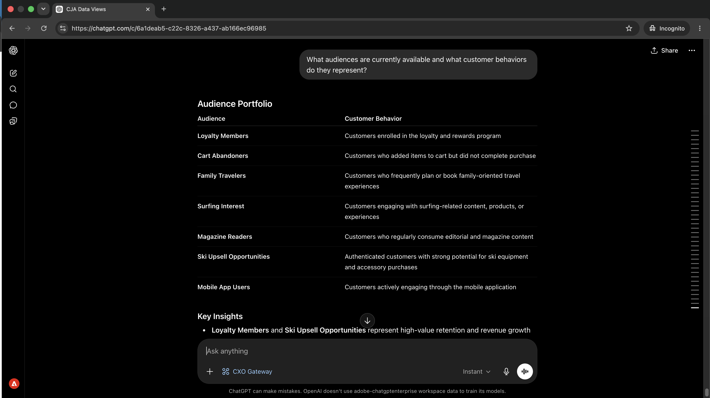

# 了解您的受众及其激活位置

<!-- last-modified: 2026-06-04 -->


了解哪些受众已激活、正在哪里流动以及目标是否健康通常意味着打开Real-Time CDP并导航多个屏幕。 本演练展示了如何通过人工智能客户端获得相同的答案，使用RTCDP MCP服务器通过纯语言问题呈现目标配置、激活状态和数据流运行状况。

| | |
| --- | --- |
| CX企业级应用程序 | Real-Time Customer Data Platform (Real-Time CDP) |
| 代理工具 | CX Enterprise MCP网关 |
| 受众 | 营销人员、分析人员、操作员 |
| 先决条件 | 与MCP兼容的AI客户端、Real-Time CDP访问 |

每个步骤显示一个代表性提示和一个AI响应示例。 您还可完成&#x200B;**更多**&#x200B;部分，以供在同一会话中进行其他探索。

## 开始之前

>[!BEGINTABS]

>[!TAB 克劳德.ai]

将CX Enterprise MCP Gateway作为自定义连接器连接以访问Real-Time CDP工具。

1. 转到Claude.ai中的&#x200B;**设置>集成**。
2. 选择&#x200B;**添加自定义连接器**&#x200B;并输入服务器URL： `https://cx-enterprise.adobe.io/mcp`
3. 选择&#x200B;**连接**&#x200B;并使用您的Adobe ID登录。

完整设置： [Claude.ai自定义连接器文档](https://support.claude.com/en/articles/11175166-get-started-with-custom-connectors-using-remote-mcp)

>[!TAB ChatGPT]

使用ChatGPT Developer Mode （需要Pro 、 Plus 、 Business 、 Enterprise或Education计划）连接CX Enterprise MCP Gateway。

1. 在&#x200B;**ChatGPT设置**&#x200B;中启用&#x200B;**开发人员模式**。
2. 转到&#x200B;**设置>集成**，然后选择&#x200B;**添加自定义连接器>远程MCP服务器**。
3. 输入服务器URL： `https://cx-enterprise.adobe.io/mcp`
4. 选择&#x200B;**连接**&#x200B;并使用您的Adobe ID登录。

完整设置： [ChatGPT MCP文档](https://developers.openai.com/api/docs/guides/tools-connectors-mcp)

>[!TAB 其他AI客户端]

使用Gemini、Microsoft Copilot、Cursor、Claude Code或其他与MCP兼容的环境？ 使用此端点连接到CX Enterprise MCP网关：

```
https://cx-enterprise.adobe.io/mcp
```

所有受支持客户端的完整设置说明： [连接到您的AI客户端](../tools/mcp-servers.md)

>[!ENDTABS]

>[!NOTE]
>
>出现提示时，请使用您的Adobe ID登录，然后选择链接到您的Real-Time CDP实例的IMS组织。 选择错误的组织是身份验证错误最常见的来源。

## 步骤1：了解受众及其代表的意义

首先，请求提供可用受众及其捕获的客户行为的清单。 这为您提供了在钻取到任何特定区段之前的完整横向。

```
What audiences are currently available and what customer behaviors do they represent?
```

+++查看示例响应



+++


## 第2步：确定最有价值的区段

鉴于受众前景，询问哪些区段规模最大，以及哪些区段具有战略价值。

```
Which audiences are the largest and what makes them valuable?
```

+++查看示例响应


+++


## 步骤3：查看激活和目标

询问您的受众当前正在流向何处以及他们被激活到哪些目标。

```
Where are our audiences currently being activated and to which destinations?
```

+++查看示例响应


+++


## 步骤4：获取战略建议

CX Enterprise MCP Gateway的RTCDP工具是只读的 — 它们会显示激活状态、目标运行状况和数据流数据，但不会修改配置。 确定问题后，将在应用程序中修复。

```
If you were our audience strategist, what would you prioritize next and why?
```

+++查看示例响应


+++


>[!NOTE]
>
>CX Enterprise MCP Gateway的RTCDP工具会显示目标和激活数据，但无法修改目标配置、区段定义或数据流设置。 在Real-Time CDP应用程序中执行修正步骤。

## 您完成了哪些工作

您将一个AI客户端连接到Real-Time CDP，并通过四个提示构建了受众组合的战略图。 您将可用受众映射到其捕获的客户行为，确定最大和最有价值的区段，确认每个受众流向何处以及流向何处，并在下次激活时收到优先推荐。 这取代了通过直接的战略对话导航多个Real-Time CDP屏幕。

## 您可以完成更多任务

CX Enterprise MCP Gateway的Real-Time CDP工具支持范围广泛的受众和激活查询。 展开下面的方案以查看可在同一会话中尝试的提示。

+++准确地了解在营销活动发送之前流向何处

激活失败是静默的。 受众在没有警告的情况下停止流动，营销活动会发送到过时的列表。 这些提示可让您清楚地了解哪些区段将在何时到达哪些目的地。

**提示**

```
Which audiences are activated to Google Ads?
```

```
Show me the activation history for the [audience name] audience.
```

```
What is the last refresh time for the [audience name] audience?
```

+++

+++在激活问题影响营销活动之前对其进行捕获

缺少运行的目标或没有活动目标的区段意味着您的营销活动接触的人数可能少于预期。 这些提示会主动显示这些间隙。

**提示**

```
Are there any audiences with no active destinations?
```

```
Are any destination dataflows showing errors right now?
```

```
Which audiences have not been updated in the last 30 days?
```

+++

+++审核并了解受众前景

当受众规模发生变化或创建新区段时，拥有清晰的库存可帮助您规划并避免激活错误的列表。 这些提示可让您根据需要进行查看。

**提示**

```
How many profiles are in the [segment name] segment?
```

```
Show me all audiences created in the last 30 days.
```

```
Which audience has grown the most in the last 60 days?
```

```
How many total profiles are in my Real-Time CDP instance?
```

+++

+++了解身份和数据质量

身份命名空间和合并策略直接影响受众中包含哪些配置文件以及如何解析这些配置文件。 这些提示可解释意外受众大小或配置文件重叠的表面配置详细信息。

**提示**

```
What identity namespaces are configured and which are most commonly used?
```

```
What merge policies are defined and which audiences use each one?
```

```
Are there any audiences using a non-default merge policy that could cause profile overlap?
```

+++


## 更多信息

| 资源 | 您将找到什么 |
| --- | --- |
| [Real-Time CDP MCP文档](https://experienceleague.adobe.com/zh-hans/docs/experience-cloud-ai/experience-cloud-ai/mcp/rtcdp-mcp) | MCP服务器设置和工具参考 |
| [Adobe AI注册表](https://developer.adobe.com/ai-registry/?type=mcp) | MCP服务器元数据和可用性 |
| [Real-Time CDP文档](https://experienceleague.adobe.com/zh-hans/docs/experience-platform/rtcdp/home) | 完整的Real-Time CDP应用程序文档 |
| [AEP目标文档](https://experienceleague.adobe.com/zh-hans/docs/experience-platform/destinations/home) | 完整目标参考 |
